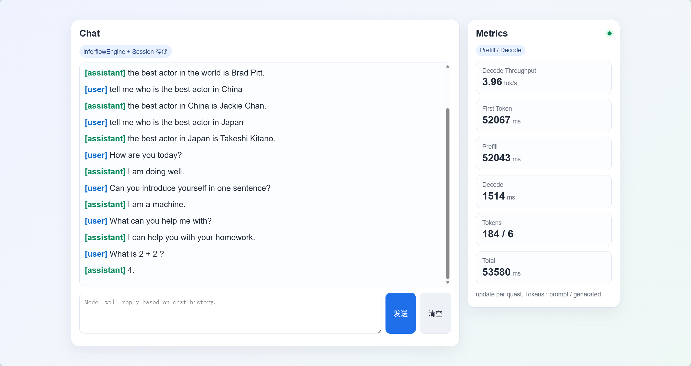
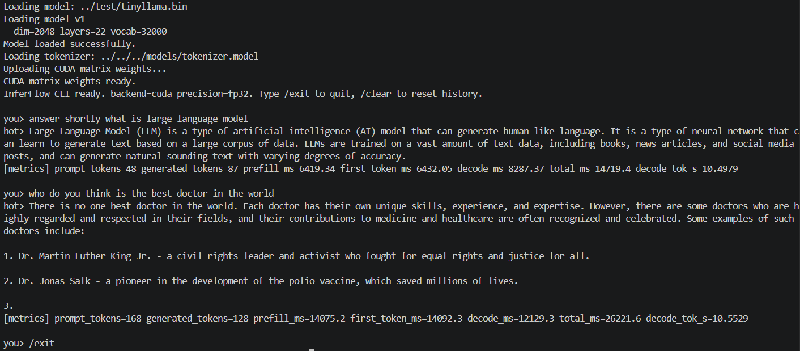

# InferFlow 本地大模型推理服务框架

InferFlow是一个面向本地与私有化部署场景的轻量级 LLM 推理服务项目。当前主线以Llama为验证模型，实现了decoder-only Transformer的推理链路、CPU Int8量化路径、可选CUDA backend、HTTP API服务层和前端对话页面


## Demo





## 当前完成内容

- 推理引擎：模型加载、Tokenizer、Sampler、KV Cache、autoregressive decoding
- 核心算子：RMSNorm、RoPE、GQA Attention、SwiGLU、LM Head
- CPU Int8：group-wise weight-only Int8、动态反量化 MatMul、OpenMP 行并行、AVX2 内层 SIMD
- CUDA backend：RMSNorm、MatMul、RoPE、Attention、GPU KV Cache 的功能性实现与 TinyLlama CPU/CUDA parity 测试
- 服务化：Boost.Asio/Beast HTTP 服务、路由分发、中间件、统一错误响应、请求体限制、连接超时、MySQL 会话与历史记录
- 前端：本地对话页面，支持会话历史、清空会话、推理 metrics 展示

当前未完成或暂缓：

- CUDA 端性能优化与 CUDA Int8 整模型推理。
- LLaMA-2-7B / Qwen2.5 的完整导出、tokenizer 与 benchmark 验证。
- 多模态视觉编码器接入。

## 目录结构

```text
inferflow/
├── llama-engine/              # C++ 推理引擎
│   ├── include/llama/          # config / engine / kv_cache / tokenizer / backend / quantization
│   ├── src/                    # 推理、算子、CPU/CUDA backend 实现
│   ├── demo/chat_cli.cpp       # CLI 对话入口
│   ├── bench/bench_forward.cpp # forward benchmark
│   └── test/                   # 单元测试与 TinyLlama 对齐测试
├── notix/httpserver/           # HTTP 服务和前端页面
├── python_prototype/           # Python/NumPy 原型与 HF 导出脚本
└── scripts/build_all.sh        # 构建脚本
```

## 构建

CPU 默认构建：

```bash
scripts/build_all.sh -j 4
```

清理旧构建目录：

```bash
scripts/build_all.sh --clean -j 4
```

CUDA可选构建：

```bash
scripts/build_all.sh --cuda -j 4
```

## CLI 推理

参数格式：

```bash
./inferflow_cli [model.bin] [tokenizer.model] [max_tokens] [backend] [precision]
```

参数说明：

```text
model.bin        模型权重文件
tokenizer.model  SentencePiece tokenizer 文件
max_tokens       单轮最多生成 token 数
backend          推理后端，可选 cpu 或 cuda
precision        权重精度模式，可选 fp32 或 int8
```

CPU FP32：

```bash
cd ./inferflow/llama-engine/build
./inferflow_cli ../test/tinyllama.bin ../../../models/tokenizer.model 64 cpu fp32
```

CPU Int8：

```bash
./inferflow_cli ../test/tinyllama.bin ../../../models/tokenizer.model 64 cpu int8
```


CUDA FP32：

```bash
cd ./inferflow/llama-engine/build
./inferflow_cli ../test/tinyllama.bin ../../../models/tokenizer.model 64 cuda fp32
```

也可以通过环境变量指定 CUDA backend：

```bash
INFERFLOW_BACKEND=cuda ./inferflow_cli ../test/tinyllama.bin ../../../models/tokenizer.model 64
```

说明：当前整模型 Int8 推理只接入 CPU 路径，CUDA 路径用于 FP32 backend 功能验证；不要使用 `cuda int8` 作为演示命令。

也可以通过环境变量开启 Int8：

```bash
INFERFLOW_INT8=1 ./inferflow_cli ../test/tinyllama.bin ../../../models/tokenizer.model 64 cpu
```

CLI 命令：

```text
/clear  清空当前 CLI 历史
/exit   退出
/quit   退出
```

## HTTP 服务

启动：

```bash
cd ./inferflow/notix/httpserver
./build-http/http_server
```

默认监听：

```text
http://127.0.0.1:10086
```

常用页面与接口：

- `GET /app`：前端对话页
- `POST /chat/completions`：非流式推理接口
- `GET /chat/history`：读取当前会话历史
- `POST /chat/clear`：清空当前会话历史与模型 KV Cache


## 测试

```bash
cd ./inferflow/llama-engine/build
./test_quantization
./test_int8_forward ../test/tinyllama.bin
./test_forward ../test/tinyllama.bin
```

CUDA 构建后可运行：

```bash
./test_cuda_backend
./test_cuda_forward ../test/tinyllama.bin
```

Forward benchmark：

```bash
./bench_forward ../test/tinyllama.bin --backend cpu --max-tokens 6 --warmup 1 --repeat 3
```
